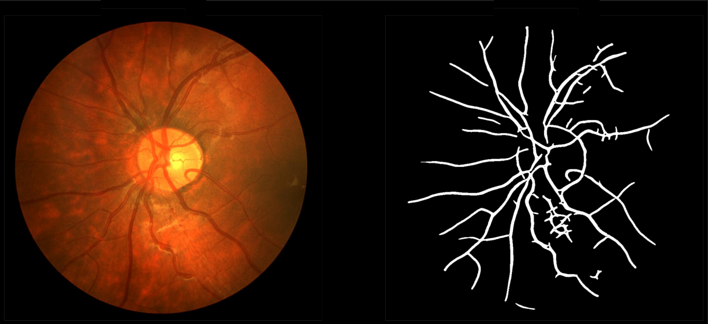

# Retinal-Vessel-Segmentation

### Problem Statement

Retinal vessel image segmentation is a pivotal challenge in medical image analysis, integral to early disease diagnosis, disease progression monitoring, and personalized treatment planning for conditions like diabetic retinopathy and glaucoma. The goal is to leverage classical machine learning methods to precisely identify and isolate blood vessels in retinal images. The complexity arises from the lower contrast in vascular structures and the need to address challenges such as noise and uneven illumination. The project aims to enhance the accuracy and efficiency of retinal vessel segmentation, contributing to improved medical diagnostics and personalized care.

### Dataset Description
The CHASEDB1 dataset comprises 28 retinal images, representing both eyes of 14 participants. Each image is accompanied by two ground truth annotations ("1stHO" and "2ndHO") from different human observers, totaling 84 images. The file naming convention includes participant numbers (01-14), eye identifiers (L/R), and ground truth sources. This dataset is vital for training and evaluating retinal vessel segmentation models.

### Setting up the code
#### Install the requirements
```  
pip3 install -r requirements.txt
```

###  Repository Structure

1. [Input](https://github.com/UtsvGrg/Retinal-Vessel-Segmentation/tree/main/Input): 20 input images used for testing the code.
2. [Output](https://github.com/UtsvGrg/Retinal-Vessel-Segmentation/tree/main/Ouput): 20 ground images of the respective inputs.
3. [RVS_Demo.ipynb](https://github.com/UtsvGrg/Retinal-Vessel-Segmentation/blob/main/RVS_Demo.ipynb): Jupyter notebook implementation of the algorithm.
4. [morpho_testing.py](https://github.com/UtsvGrg/Retinal-Vessel-Segmentation/blob/main/morpho_testing.py): Testing script of the entire algorithm.
5. [gabor_testing.py](https://github.com/UtsvGrg/Retinal-Vessel-Segmentation/blob/main/gabor_testing.py): Testing script which includes gabor filters as well.
6. [accuracy_calculator.py](https://github.com/UtsvGrg/Retinal-Vessel-Segmentation/blob/main/accuracy_calculator.py): Accuracy calculator based on ground image and generated segmentated images.
7. [requirements.txt](https://github.com/UtsvGrg/Retinal-Vessel-Segmentation/blob/main/requirements.txt): Contains list of dependencies.

Link to [Project Report](https://github.com/UtsvGrg/Retinal-Vessel-Segmentation/blob/main/RVS_ProjectReport.pdf)

Link to [Presentation](https://github.com/UtsvGrg/Retinal-Vessel-Segmentation/blob/main/Retinal%20Vessel%20Segmentation.pdf)



### Methodology and Pre-processing

### Results
##### Accuracy
The segmentation process yielded an accuracy of about 95% reflecting the effectiveness of the devised methodology in accurately identifying and isolating retinal vessels.
##### Structural Similarity Index (SSI)
The Structural Similarity Index measure, a metric assessing the similarity between the ground truth and segmented images, provided a value of 0.87. An SSI value of 1 indicates perfect similarity, and 0 denotes no similarity. The achieved value suggests a substantial degree of structural similarity between the ground truth and segmented images.
##### Peak Signal-to-Noise Ratio (PSNR)
The Peak Signal-to-Noise Ratio, measuring the quality of the segmentation by evaluating the ratio of the maximum possible power of a signal to its noise, was approximately
55. Higher PSNR values indicate better image quality, reflecting the accuracy and fidelity of the segmented vessel structures.
